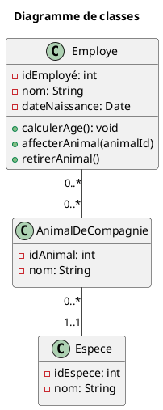

# Documentation de la SP d'une API RESTFul sur la gestion des animaux de compagnie

Cette section du fichier README.md contient la documentation de l'API pour les éléments du modèle Animal, Employe et Espèce. Cette documentation est essentielle pour comprendre comment utiliser et interagir avec l'API. Elle fournit des informations sur les différentes fonctionnalités de l'API, les endpoints disponibles, les paramètres acceptés et les réponses renvoyées.

Ce code inclut une image markdown et un diagramme PlantUML. L'image est un diagramme de classe représentant les relations entre trois classes : Employe, AnimalDeCompagnie et Espece. 

Relations :

- Chaque employé peut être associé à zéro, un ou plusieurs animaux de compagnie.
- Chaque animal de compagnie peut être associé à zéro, un ou plusieurs employés.
- Chaque animal de compagnie est lié à une et une seule espèce.
Les cardinalités dans les relations spécifient les multiplicités entre les différentes classes.

Ce diagramme de classes permet de modéliser les relations entre les employés, les animaux de compagnie et les espèces, facilitant ainsi la gestion des responsabilités des employés envers les animaux de compagnie et la traçabilité des informations associées.

## Animal

### Récupérer tous les animaux

Pour récupérer tous les animaux, vous pouvez utiliser la méthode GET sur l'endpoint `/animaux`. Cette requête renverra une liste de tous les animaux présents dans le système.

### Récupérer un animal par ID

Pour récupérer un animal spécifique en utilisant son ID, vous pouvez utiliser la méthode GET sur l'endpoint `/animaux/{id}`. Remplacez `{id}` par l'ID de l'animal que vous souhaitez récupérer.

Exemple de requête : 
GET /animaux/123

### Créer un nouvel animal

Pour créer un nouvel animal, vous pouvez utiliser la méthode POST sur l'endpoint `/animaux`. Vous devez fournir les informations de l'animal dans le corps de la requête au format JSON.

Exemple de requête : 
POST /animaux
Content-Type: application/json

{
    "nom": "Felix",
    "espece": "Chat",
    "age": 3
}

### Mettre à jour un animal

Pour mettre à jour les informations d'un animal existant, vous pouvez utiliser la méthode PUT sur l'endpoint `/animaux/{id}`. Remplacez `{id}` par l'ID de l'animal que vous souhaitez mettre à jour. Vous devez fournir les nouvelles informations de l'animal dans le corps de la requête au format JSON.

Exemple de requête : 
PUT /animaux/123
Content-Type: application/json

{
    "nom": "Felix",
    "espece": "Chat",
    "age": 4
}

### Supprimer un animal

Pour supprimer un animal, vous pouvez utiliser la méthode DELETE sur l'endpoint `/animaux/{id}`. Remplacez `{id}` par l'ID de l'animal que vous souhaitez supprimer.

Exemple de requête : 
DELETE /animaux/123

###  Créer un nouvel employé

Méthode: POST
Endpoint: /employes
Description: Crée un nouvel employé en fournissant les informations nécessaires dans le corps de la requête au format JSON.
Exemple de requête :

POST /employes
Content-Type: application/json

{
    "nom": "Dupont",
    "prenom": "Jean",
    "age": 30,
    "poste": "Ingénieur"
}

###  Récupérer tous les employés

Méthode: GET
Endpoint: /employes
Description: Récupère la liste de tous les employés présents dans le système.

###  Récupérer un employé par ID

Méthode: GET
Endpoint: /employes/{employeId}
Description: Récupère les détails d'un employé spécifique en utilisant son ID.

###  Mettre à jour un employé

Méthode: PUT
Endpoint: /employes/{employeId}
Description: Met à jour les informations d'un employé existant en utilisant son ID. Les nouvelles informations doivent être fournies dans le corps de la requête au format JSON.
Exemple de requête :

PUT /employes/456
Content-Type: application/json

{
    "nom": "Dupont",
    "prenom": "Jean",
    "age": 31,
    "poste": "Ingénieur Senior"
}

###  Supprimer un employé

Méthode: DELETE
Endpoint: /employes/{employeId}
Description: Supprime un employé spécifique en utilisant son ID.
Exemple de requête :

DELETE /employes/456

###  Calculer l'âge d'un employé

Méthode: GET
Endpoint: /employes/{employeId}/age
Description: Calcule l'âge d'un employé spécifique.
Exemple de requête :

GET /employes/456/age

###  Affecter un animal à un employé

Méthode: POST
Endpoint: /employes/{employeId}/addAnimal/{animalId}
Description: Affecte un animal spécifique à un employé en utilisant les IDs respectifs de l'employé et de l'animal.
Exemple de requête :

POST /employes/456/addAnimal/789

###  Retirer un animal à un employé

Méthode: POST
Endpoint: /employes/{employeId}/removeAnimal/{animalId}
Description: Retire un animal spécifique à un employé en utilisant les IDs respectifs de l'employé et de l'animal.
Exemple de requête :

POST /employes/456/removeAnimal/789
